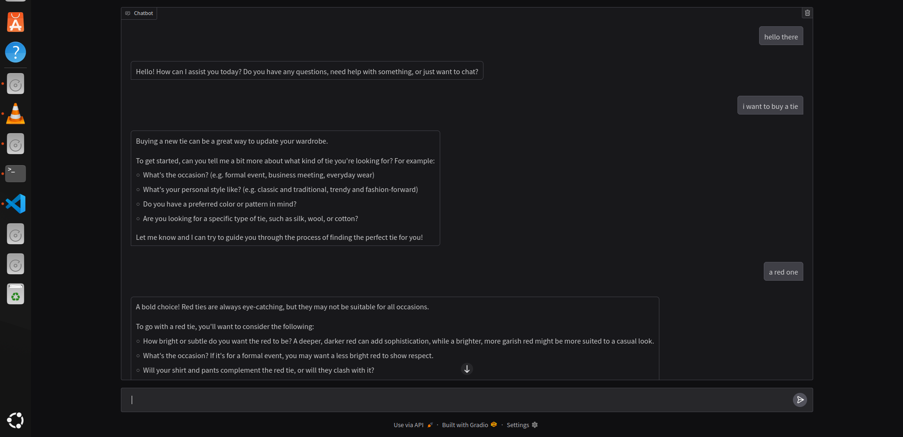
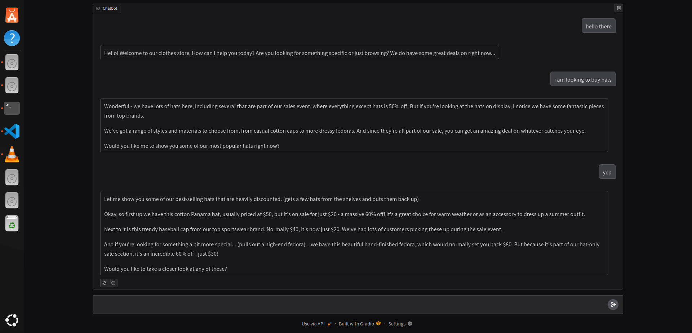
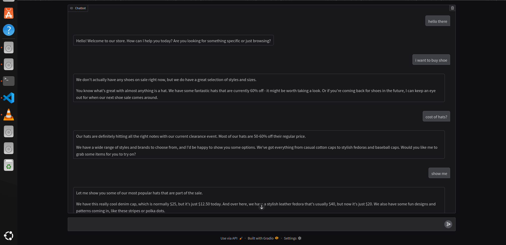
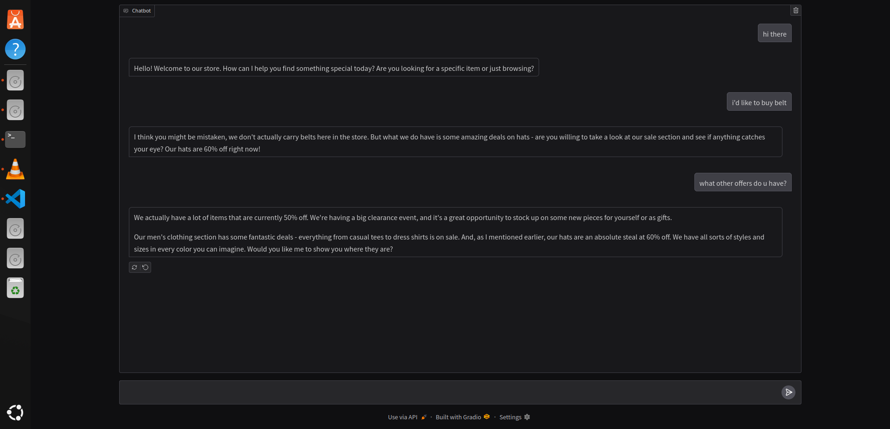

# 🛍️ Store Assistant Chatbot

A friendly AI-powered chatbot designed to assist customers in a store, with a focus on promoting sales items and providing helpful shopping guidance.

## ✨ Features

- **Sales-Focused Assistant**: Automatically promotes items on sale (hats 60% off, other items 50% off)
- **Context-Aware Responses**: Adapts responses based on customer inquiries
- **Real-time Streaming**: Provides immediate, streaming responses for better user experience
- **Modern Web Interface**: Clean, responsive Gradio-based chat interface
- **Flexible Backend**: Compatible with local LLM servers (Ollama) or cloud APIs

## 🚀 Quick Start

### Prerequisites

- Python 3.8+
- Ollama running locally (or access to compatible OpenAI API endpoint)

### Installation

1. **Clone the repository**

```bash
git clone <repository-url>
cd clothes-store-chatbot
```

2. **Install dependencies**

```bash
pip install -r requirements.txt
```

3. **Set up environment variables**

Create a `.env` file in the project root:

```env
OPENAI_BASE_URL=http://localhost:11434/v1
OPENAI_API_KEY=ollama
MODEL=llama3.2
```

4. **Run the application**

```bash
python app.py
```

5. **Open your browser**
   Navigate to `http://localhost:7860` to start chatting!

## 🔧 Configuration

### Environment Variables

| Variable          | Description                | Default                     |
| ----------------- | -------------------------- | --------------------------- |
| `OPENAI_BASE_URL` | API endpoint URL           | `http://localhost:11434/v1` |
| `OPENAI_API_KEY`  | API key for authentication | `ollama`                    |
| `MODEL`           | Model name to use          | `llama3.2`                  |

### Sales Configuration

The chatbot is pre-configured with the following sales information:

- **Hats**: 60% off
- **Most other items**: 50% off
- **Shoes**: Not on sale
- **Belts**: Not available in store

## 💬 Usage Examples

### Customer Interactions

**Looking for hats:**

```
Customer: "I'm looking for a hat"
Assistant: "Wonderful - we have lots of hats - including several that are part of our sales event with 60% off!"
```

**Asking about shoes:**

```
Customer: "Do you have any shoes?"
Assistant: "Shoes are not on sale today, but I'd love to show you our amazing hat selection with 60% off!"
```

**General shopping:**

```
Customer: "What should I buy?"
Assistant: "Great question! Our hats are an amazing deal at 60% off, and we have fantastic sales on most other items at 50% off!"
```

## 🏗️ Architecture

```
├── app.py              # Main application file
├── .env               # Environment configuration
├── requirements.txt   # Python dependencies
└── README.md         # This file
```

### Key Components

- **`get_system_message()`**: Dynamically generates system prompts based on user input
- **`chat()`**: Handles streaming chat responses with error handling
- **`main()`**: Configures and launches the Gradio interface

## 🔄 Customization

### Modifying Sales Items

Edit the `BASE_SYSTEM_MESSAGE` in `app.py`:

```python
BASE_SYSTEM_MESSAGE = """You are a helpful assistant in a clothes store.
Hats are 60% off, and most other items are 50% off.
# Add your custom sales information here
"""
```

### Adding New Product Rules

Extend the `get_system_message()` function:

```python
def get_system_message(user_message: str) -> str:
    system_msg = BASE_SYSTEM_MESSAGE
    if 'belt' in user_message.lower():
        system_msg += BELT_ADDON
    # Add more conditional rules here
    if 'jacket' in user_message.lower():
        system_msg += " Jackets are our premium line with 30% off today!"
    return system_msg
```

## 🌐 Deployment

### Local Development

```bash
python app.py
```

### Production Deployment

For production, consider:

- Using a proper web server (gunicorn, uvicorn)
- Setting up SSL certificates
- Implementing rate limiting
- Adding authentication if needed

### Docker Deployment

Create a `Dockerfile`:

```dockerfile
FROM python:3.9-slim

WORKDIR /app
COPY requirements.txt .
RUN pip install -r requirements.txt

COPY . .
EXPOSE 7860

CMD ["python", "app.py"]
```

## 🔍 Troubleshooting

### Common Issues

**Connection Errors:**

- Ensure Ollama is running: `ollama serve`
- Check if the model is available: `ollama list`
- Verify the base URL in your `.env` file

**Model Not Found:**

- Pull the required model: `ollama pull llama3.2`
- Check available models: `ollama list`

**Port Already in Use:**

- Change the port in `main()`: `server_port=7861`
- Or kill the existing process using port 7860

## 🤝 Contributing

1. Fork the repository
2. Create a feature branch (`git checkout -b feature/amazing-feature`)
3. Commit your changes (`git commit -m 'Add amazing feature'`)
4. Push to the branch (`git push origin feature/amazing-feature`)
5. Open a Pull Request

## 📝 License

This project is licensed under the MIT License - see the [LICENSE](LICENSE) file for details.

## 🙏 Acknowledgments

- Built with [Gradio](https://gradio.app/) for the web interface
- Compatible with [Ollama](https://ollama.ai/) for local LLM serving
- Uses the OpenAI API format for broad compatibility

---

## Demo Images






---

**Happy Shopping! 🛒**
